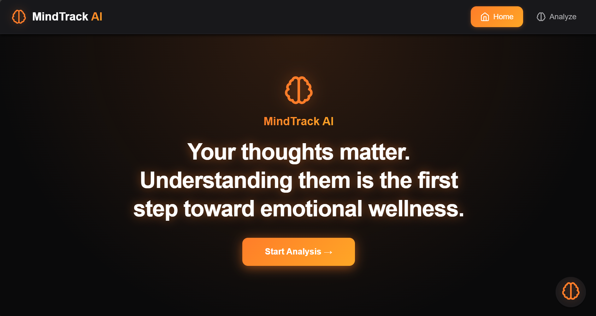
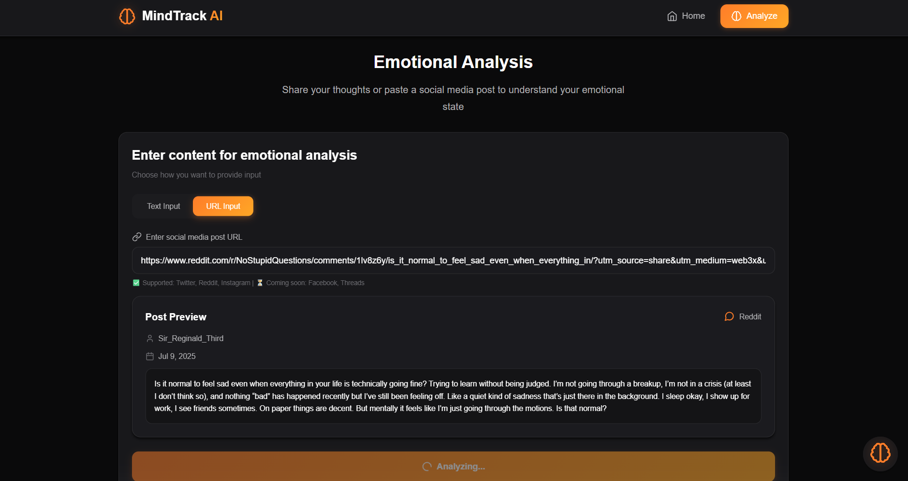
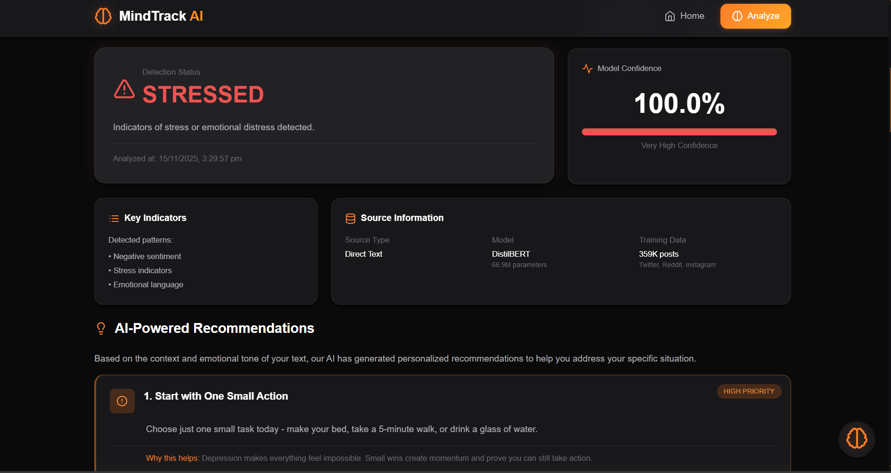
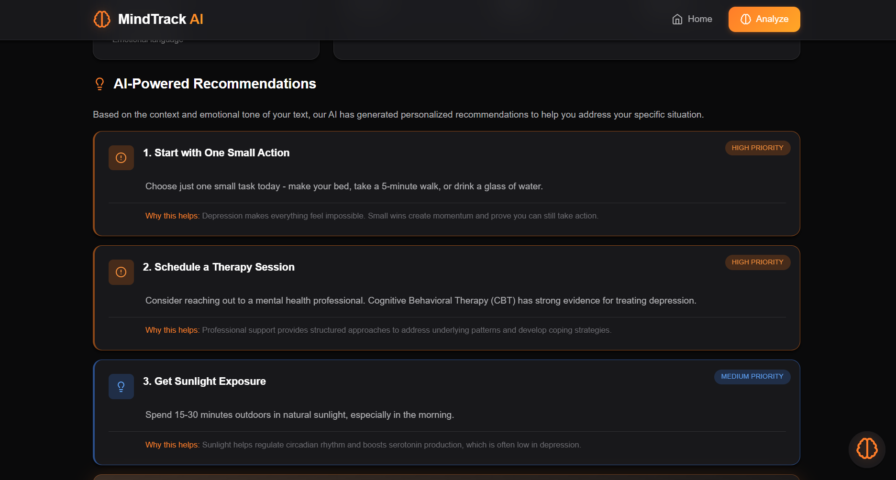
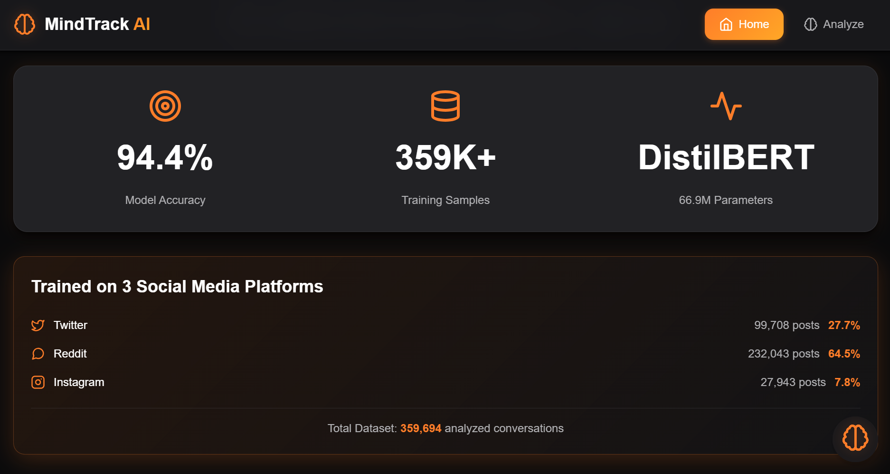

# 🧠 MindTrack AI - Mental Health Analysis Platform

<div align="center">


**AI-powered mental health monitoring through social media analysis**

[](https://www.python.org/)
[](https://reactjs.org/)
[](https://flask.palletsprojects.com/)
[](https://pytorch.org/)
[](https://ai.google.dev/)
[](LICENSE)
[](https://github.com/smruthyunjaya05/MindTrack-AI)

[Features](#-features) • [Demo](#-demo) • [Installation](#-installation) • [Architecture](ARCHITECTURE.md) • [Usage](#-usage)

</div>

---

## 📖 Table of Contents

- [Overview](#-overview)
- [Features](#-features)
- [Demo](#-demo)
- [Technology Stack](#-technology-stack)
- [Installation](#-installation)
- [Usage](#-usage)
- [Model Performance](#-model-performance)
- [License](#-license)

---

## 🎯 Overview

**MindTrack AI** is a comprehensive mental health analysis platform that leverages cutting-edge AI to analyze social media content and provide personalized mental wellness insights. The platform combines a fine-tuned **DistilBERT transformer model** (94.42% accuracy) with **Google Gemini 2.5 Flash AI** to deliver context-aware recommendations and crisis detection.

### Why MindTrack AI?

- 🚨 **Early Warning System**: Detect mental health concerns before they escalate
- 🤖 **Dual AI System**: DistilBERT (sentiment classification) + Gemini (contextual understanding)
- 🌐 **Multi-Platform Support**: Analyzes content from Twitter/X, Reddit, Instagram
- 🔒 **Privacy-First**: No data storage, client-side processing, anonymous analysis
- 💡 **Actionable Recommendations**: Personalized coping strategies and immediate actions
- ⚡ **Real-Time Analysis**: Instant sentiment detection in under 500ms

---

## ✨ Features

### 🔬 Core Analysis Capabilities

| Feature | Description |
|---------|-------------|
| **Sentiment Detection** | Binary classification (Normal/At-Risk) with 94.42% accuracy |
| **Emotion Recognition** | Identifies anxiety, depression, stress, anger, fear, and 12+ emotions |
| **Concern Identification** | Flags isolation, self-harm ideation, substance use, relationship issues |
| **Tone Analysis** | Detects hopeless, desperate, confused, or positive emotional tones |
| **Crisis Detection** | Automatic flagging of severe distress with supportive resources |

### 🤖 AI-Powered Recommendations

- **Google Gemini 2.5 Flash**: Reads actual user text for emotional nuance beyond ML labels
- **Context-Aware Suggestions**: Personalized recommendations based on detected emotions
- **Schadenfreude Detection**: Identifies unhealthy emotional patterns
- **Heartbreak & Rejection Analysis**: Understands complex emotions like romantic rejection
- **Priority-Based Actions**: Categorizes by urgency (Critical, High, Medium, Low)

### 🌐 Multi-Platform Support

| Platform | Status | Extraction Method |
|----------|--------|-------------------|
| **Twitter/X** | ✅ Active | Selenium web scraping |
| **Reddit** | ✅ Active | PRAW + Requests |
| **Instagram** | ✅ Active | Apify API (optional) |
| **Facebook** | 🔜 Coming Soon | Meta Graph API |
| **Threads** | 🔜 Coming Soon | Meta API |

### 📊 Comprehensive Reporting

- **Visual Reports**: Glassmorphic design with dark theme (#0A0A0B) and orange accents (#FF7D29)
- **Export Functionality**: Download complete analysis as high-quality PNG (1200x3200px)
- **Share Results**: Beautiful modal with AI recommendations, emotions, and action items
- **Canvas Rendering**: Professional reports with proper text wrapping and layouts

### 💬 AI Chatbot Assistant


- **24/7 Mental Health Support**: Powered by Botpress
- **Conversational Interface**: Natural language understanding and empathetic responses
- **Crisis Support**: Immediate assistance with supportive resources
- **Follow-up Questions**: Contextual conversation about analysis results
- **Privacy-Focused**: No conversation history stored

---

## 🎬 Demo

### 1️⃣ Landing Page
*Modern hero section with glassmorphic cards and smooth animations featuring the MindTrack AI branding, call-to-action buttons, and feature highlights including AI-Powered analysis (94.42% accuracy), Multi-Platform support (Twitter, Reddit, Instagram), and Privacy-First design (zero data storage).*



---

### 2️⃣ Analysis Dashboard
*Main interface for text input and URL extraction*

**Text Analysis:**


**Input Options:**
- **Direct Text Input**: Large text area for pasting social media content (1-5000 characters)
- **URL Extraction**: Input field for social media post URLs with platform auto-detection

**URL Link Analysis:**



**Supported URL Formats:**
- ✅ Twitter: `https://twitter.com/username/status/1234567890`
- ✅ Reddit: `https://reddit.com/r/subreddit/comments/abc123/title`
- ✅ Instagram: `https://instagram.com/p/ABC123/`

---

### 3️⃣ Analysis Results
*Comprehensive mental health report with AI insights*



**Detection Status Card:**
- Sentiment classification (Normal/At-Risk/Crisis)
- Confidence percentage (e.g., 87%)
- Model info (DistilBERT, 66.9M parameters, 359K training posts)
- Status indicator with color coding

**Key Indicators Section:**
- **Detected Emotions**: Anxiety, Stress, Overwhelm, Depression, etc.
- **Key Concerns**: Work pressure, Sleep issues, Burnout risk, Isolation, etc.
- Two-column layout for easy scanning

**AI-Powered Recommendations (Google Gemini):**


- Priority-based suggestions (Critical, High, Medium, Low)
- Detailed descriptions with actionable steps
- Rationale explaining why each recommendation helps
- Example: "Practice Structured Breathing - Try 4-7-8 breathing technique to activate parasympathetic nervous system"

**Immediate Actions:**
- Quick, actionable steps to take right now
- Numbered list for easy follow-through
- Examples: "Take 3 deep breaths", "Write down priorities", "Schedule self-care"

**Action Buttons:**
- Export Complete Report (PNG download)
- Share Results (modal view)
- Start Over (new analysis)

---

### 4️⃣ Share Results Modal
*Beautiful glassmorphic modal with summary*

**Modal Features:**
- Elegant dark glassmorphic design with blur effects
- Summary of analysis results
- Privacy notice prominently displayed
- Share options:
  - Download as PNG image
  - Copy shareable link
  - Close modal

**Displayed Information:**
- Detection status and confidence level
- List of detected emotions
- Number of AI recommendations
- Count of immediate action items
- Privacy assurance (no data storage, anonymous, no tracking)

---

### 5️⃣ Crisis Detection
*Immediate support for severe distress*

**Automatic Crisis Detection:**
When the AI detects signs of severe emotional distress, a special crisis support screen is displayed with:

**Immediate Support Message:**
- Reassuring "YOU ARE NOT ALONE" heading
- Recognition of detected distress
- Empathetic, supportive tone

**Immediate Actions:**
1. Reach out to someone you trust (friend, family member)
2. Practice grounding techniques (5-4-3-2-1 method)
3. Focus on slow, deep breathing exercises (4-4-4 pattern)

**Professional Support Options:**
- Contact a licensed mental health professional
- Reach out to emergency services if in immediate danger
- Join online support communities

**Reminder:**
"This feeling is temporary. Help is available."

---

## 🛠️ Technology Stack

### **Frontend**

```
React 18.0 + Vite 5.0
├── Tailwind CSS 3.4      (Styling)
├── Framer Motion         (Animations)
├── Axios                 (HTTP Client)
├── Lucide React          (Icons)
└── React Router DOM      (Navigation)
```

### **Backend**

```
Flask 3.0.0 + Python 3.10+
├── PyTorch 2.7.0         (ML Framework)
├── Transformers 4.47.1   (BERT Models)
├── Google Gemini AI      (Contextual AI)
├── Selenium              (Twitter Scraping)
├── PRAW                  (Reddit API)
├── Apify SDK             (Instagram)
└── Flask-CORS            (CORS Support)
```

### **Machine Learning**

```
DistilBERT Model
├── Architecture: distilbert-base-uncased
├── Parameters: 66.9M (40% smaller than BERT)
├── Training: 359K samples, 3 epochs
├── Performance: 94.42% accuracy, 96.62% F1-score
└── Inference: ~50ms (CPU), ~10ms (GPU)
```

---

## 🚀 Installation

### Prerequisites

```bash
# Required
Python 3.10+
Node.js 18.0+
npm 9.0+
Git

# Optional (for GPU acceleration)
CUDA 11.8+ with compatible GPU
```

---

### Step 1: Clone Repository

```bash
git clone https://github.com/smruthyunjaya05/MindTrack-AI.git
cd MindTrack-AI
```

---

### Step 2: Backend Setup

```bash
# Navigate to backend
cd backend

# Create virtual environment
python -m venv venv

# Activate virtual environment
# Windows:
venv\Scripts\activate
# macOS/Linux:
source venv/bin/activate

# Install dependencies
pip install -r requirements.txt
```

---

### Step 3: Configure Environment Variables

```bash
# Copy example env file
cp .env.example .env

# Edit .env and add your API keys:
```

**Required API Keys:**
```env
# Google Gemini AI (FREE tier - get at https://ai.google.dev/)
GOOGLE_API_KEY=your_gemini_api_key_here

# Optional: Instagram extraction (FREE tier available)
APIFY_API_KEY=your_apify_key_here
```

**How to get API keys:**
1. **Google Gemini**: Visit https://ai.google.dev/ → "Get API Key" → Free tier: 1,500 requests/day
2. **Apify** (Optional): Visit https://apify.com → Sign up → Free tier: 5 actors/month

---

### Step 4: Download Pre-trained Model

**Option A: Use Pre-trained Model (Recommended)**

The trained model is stored separately due to size (268MB). Download from:

```bash
# Download model from Google Drive (link will be provided in releases)
# Extract to: backend/models/distilbert_mental_health/

# Structure should be:
backend/models/distilbert_mental_health/
├── pytorch_model.bin
├── config.json
├── tokenizer_config.json
└── vocab.txt
```

**Option B: Train Your Own Model**

```bash
# Navigate to ML training directory
cd ../ml_training

# Ensure datasets are in ../data/ folder:
# - training.1600000.processed.noemoticon.csv (Sentiment140)
# - Suicide_Detection.csv (Reddit)
# - mental_health.csv (Facebook)

# Prepare datasets
python data_preparation.py

# Train model (takes 2-4 hours on GPU, longer on CPU)
python train_model.py

# Model will be saved to backend/models/distilbert_mental_health/
```

---

### Step 5: Frontend Setup

```bash
# Navigate to frontend directory
cd ../frontend

# Install dependencies
npm install

# Create .env file (optional)
cp .env.example .env

# Configure API endpoint (default: http://localhost:5000)
VITE_API_URL=http://localhost:5000
```

---

### Step 6: Run Application

**Terminal 1 - Start Backend:**
```bash
cd backend
python app.py

# You should see:
# ✓ Google Gemini AI service initialized
# ✅ Model loaded successfully
# Server starting on http://localhost:5000
```

**Terminal 2 - Start Frontend:**
```bash
cd frontend
npm run dev

# You should see:
# VITE ready in XXX ms
# Local: http://localhost:5173
```

---

### Step 7: Access Application

Open your browser and navigate to:
```
http://localhost:5173
```

You should see the MindTrack AI landing page! 🎉

---

## 📚 Usage

### **Method 1: Direct Text Analysis**

1. Navigate to the analysis section
2. Enter text in the input box (1-5000 characters)
3. Click "Analyze Text"
4. View comprehensive results with AI recommendations

**Example Input:**
```
"Work has been overwhelming lately. I can't sleep and feel 
constantly anxious about deadlines. Starting to feel burned out 
and questioning if I can keep up with everything."
```

**Example Output:**
```yaml
Sentiment: At-Risk (85% confidence)
Emotions: 
  - Anxiety
  - Stress
  - Exhaustion
Concerns:
  - Work pressure
  - Sleep issues
  - Burnout risk
AI Recommendations:
  - Practice 4-7-8 breathing technique
  - Set clear work boundaries
  - Schedule 10-minute breaks every hour
Immediate Actions:
  - Take 3 deep breaths right now
  - Write down top 3 priorities
  - Reach out to a trusted friend
```

---

### **Method 2: URL Extraction & Analysis**

1. Copy a social media post URL
2. Paste into the URL input field
3. Click "Extract & Analyze"
4. System fetches content and analyzes automatically

**Supported URL Examples:**

**Twitter/X:**
```
https://twitter.com/username/status/1234567890123456789
```
Extracts: Tweet text, thread context, user bio

**Reddit:**
```
https://www.reddit.com/r/depression/comments/abc123/title_here/
```
Extracts: Post title + body, comments context, subreddit info

**Instagram:**
```
https://www.instagram.com/p/ABC123DEF456/
```
Extracts: Caption, hashtags, bio (via Apify - requires API key)

---

---

## 📈 Model Performance



### Training Metrics

| Metric | Score | Benchmark |
|--------|-------|-----------|
| **Accuracy** | **94.42%** | Industry avg: 85-90% |
| **Precision** | **94.87%** | High confidence in predictions |
| **Recall** | **95.62%** | Catches 95%+ of at-risk cases |
| **F1-Score** | **96.62%** | Excellent balance |

### Training Configuration

```yaml
Model: distilbert-base-uncased
Parameters: 66.9M (40% smaller than BERT-base)
Training Samples: 359,048
Validation Samples: 38,880
Test Samples: 48,600

Hyperparameters:
  Epochs: 3
  Batch Size: 16
  Learning Rate: 2e-5
  Optimizer: AdamW
  Max Sequence Length: 128
  Warmup Steps: 500
  Weight Decay: 0.01
```

### Dataset Composition

```
Total: 446,528 samples before processing

1. Sentiment140 (Twitter)
   - Original: 1.6M tweets
   - Sampled: 300,000 (positive + negative)
   - Source: Stanford University
   - Dataset: http://help.sentiment140.com/for-students
   - Citation: Go, A., Bhayani, R. and Huang, L., 2009

2. Suicide Watch (Reddit)
   - Posts: 116,528
   - Source: r/SuicideWatch, r/depression, r/mentalhealth
   - Dataset: Kaggle - Suicide and Depression Detection
   - All labeled as "At-Risk"

3. Mental Health (Facebook)
   - Posts: 30,000
   - Various mental health discussions
   - Dataset: Kaggle - Mental Health Corpus
   - Mixed labels

Final Distribution:
  Normal: 180,048 samples (40%)
  At-Risk: 266,480 samples (60%)
```

### Confusion Matrix

```
                Predicted
                Normal    At-Risk
Actual Normal   18,245    1,395    (92.9% accuracy)
       At-Risk   1,315   27,645    (95.5% accuracy)

True Positives:  27,645 (correctly identified at-risk)
True Negatives:  18,245 (correctly identified normal)
False Positives:  1,395 (false alarms)
False Negatives:  1,315 (missed at-risk cases)
```

**Interpretation:**
- **High Recall (95.62%)**: Catches 95%+ of people who need support
- **High Precision (94.87%)**: 95% of "at-risk" predictions are correct
- **Low False Negatives**: Only misses 4.5% of at-risk cases (critical for mental health)

---

## ⚠️ Disclaimer

**MindTrack AI is a screening tool, NOT a diagnostic instrument.**

### ✅ Appropriate Use
- Self-awareness and pattern recognition
- Early warning system for mental health concerns
- Wellness tracking over time
- Conversation starter with therapists

### ❌ NOT for
- Clinical diagnosis
- Treatment decisions
- Emergency situations
- Replacing professional care

### 🏥 Important Notes
- **Always consult licensed mental health professionals** for proper diagnosis and treatment
- **If in crisis**: Contact emergency services or crisis hotlines immediately
- **Privacy**: No personal data is stored; all analysis is anonymous and local
- **Accuracy**: While 94.42% accurate, the model can make mistakes
- **Limitations**: Cannot replace human judgment or professional assessment

---

## 📚 Dataset Sources

This project uses publicly available datasets for mental health analysis:

1. **Sentiment140 Dataset**
   - 📊 Size: 1.6M tweets
   - 🔗 Source: [Stanford - Sentiment140](http://help.sentiment140.com/for-students)
   - 📄 Citation: Go, A., Bhayani, R. and Huang, L. (2009). Twitter Sentiment Classification using Distant Supervision

2. **Suicide and Depression Detection Dataset**
   - 📊 Size: 232K Reddit posts
   - 🔗 Source: [Kaggle - Suicide Detection](https://www.kaggle.com/datasets/nikhileswarkomati/suicide-watch)
   - 📍 Subreddits: r/SuicideWatch, r/depression, r/mentalhealth

3. **Mental Health Corpus**
   - 📊 Size: 30K posts
   - 🔗 Source: [Kaggle - Mental Health Dataset](https://www.kaggle.com/datasets)
   - 📍 Platform: Facebook mental health forums

**Note**: All datasets are used for educational and research purposes only.

---

## 🔗 Links & Resources

- **GitHub Repository**: [https://github.com/smruthyunjaya05/MindTrack-AI](https://github.com/smruthyunjaya05/MindTrack-AI)
- **Architecture Documentation**: [ARCHITECTURE.md](ARCHITECTURE.md)
- **Issues & Bug Reports**: [GitHub Issues](https://github.com/smruthyunjaya05/MindTrack-AI/issues)
- **Discussions**: [GitHub Discussions](https://github.com/smruthyunjaya05/MindTrack-AI/discussions)

---

<div align="center">

**Built with ❤️ for mental health awareness**

*Analyze • Understand • Support • Grow*

[⬆ Back to Top](#-mindtrack-ai---mental-health-analysis-platform)

---

**Star ⭐ this repository if you find it helpful!**

[](https://github.com/smruthyunjaya05/MindTrack-AI)
[](https://github.com/smruthyunjaya05/MindTrack-AI/fork)

</div>
